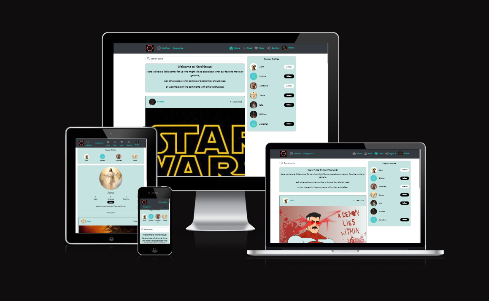
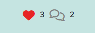

# NerdNexus

NerdNexus is a social platform created for enthusiasts of comics, books, movies & games. Users who interact with the site can post their opinions, comment on others posts, like posts, read & interact with other users.

NerdNexus has a user-friendly interface so navigating the site, posts, creating posts, comments or interacting with other user’s posts can be done with ease.

 

[You can view this site here](https://nerdnexus-a8d8c616a59c.herokuapp.com/)

## Contents

### [Features](#features-1)

- [Features yet to add](#features-yet-to-add)

### [User Experience](#user-experience-1) 
- [Goal](#project-goal)
- [Agile](#agile)
- [User Expectations](#user-expectations)
- [Wireframes](#wireframes)
- [Font & Color Scheme](#font--color-scheme)

### [Technologies Used](#technologies-used-1)
- [Libraries, Frameworks & Programming Languasges Used](#libraries-frameworks--programming-languages-used)

### [Testing](#testing-1)
  - [Manual testing](#manual-testing)
    - [Backend](#backend)
    - [Frontend](#frontend)
  - [Validator testing](#validator-testing)
  - [Accessibility](#accessibility)

### [Bug Encounters](#bug-encounters-1)
  - [Solved](#solved)
  - [Unsolved](#unsolved)

### [Deployment](#deployment-1)

### [Credits](#credits-1)

# Features
### Welcoming page

- This section welcomes users to the site & gives a small information of what users can do.

### Navbar

- The navigation bar is fully reponsive on all screen sizes.
- Clicking on any of the locations on the navbar will lead the user to that specific location.
- If user is not logged in or has an account, they will only only get specific locations to navigate through. The same is for logged in users.
- Logged in users will not see sign up or sign in options when already logged in & also get two new options instead.
- At the category dropdown menu, the user can choose between 4 categories which will narrow down the posts they see to the chosen category.
- The searchbar will allow the user to search for categories, author & title.

### Create Post

- Only logged in users can create posts.
- If image or title isn't typed in, the user will get a warning.

### Edit/ Delete Post

- This page gives the author the option to edit or delete their post by pressing the three dots button on the right side of the post. 
- When clicking the delete button, it removes the post right away.
- If the user wants to edit their post, they will be redirected to the edit page where all of the previously written post will be there until the user makes changes or presses the cancel button which will cancel any changes made & redirect the user to the previous page.

### Post

- This is how a post looks like after beaing created

### Sign Up

- The form enables the user to create an account.
- If the user already has an account, they can press the "Sign in here" link to be lead to the login page.
- If the user skips writing username or writes the "confirm passwords" incorrectly, they will get an alert.

### Login

- The form enables the user to log in to their account.
- If the user doesn't have an account, they can press the "Sign up here" link to be lead to the Sign up page.
- If the user writes their password or username incorrectly, they will get an alert warning.

### Logout

- The user will log out as soon as the button is pressed & redirected to the home page.

### Like & Comment Counter
 - Users will see the counters like normal but cant like anything unless logged in. 
 - When hovering on the heart button, the outline color will be red until pressed.
 - If the user presses the like button, the heart will change color to red & the like will add +1 to the counter. If pressed again, the counter will go down -1 or until 0 & the outline color will revert back to gray.
 - Comment counter will only go up in number if comments have been written.

### Post Comment Section
 - Only users can leave comments on reviews.
 - If not logged in, "my comment" section will not be visible.

### Comment Section
 - Comment section can be seen by any user(logged in or not) on the site.
 - Comment section shows
   - Name
   - Time it was made
   - Like button
   - Comment
 - The author of the comment can decide to delete or edit their comment.
 - When deleting tyhe comment it will disapear right away, if editing, the comment will still have the previous written comment until the user decides to change & save or cancel editing.

### Popular Profiles

- Popular profiles will add the profile with most likes on the top of the list.

### Profile Page

- This is the users page, here they can see how many posts they've made, how many followers they have, how many they are following, their bio information & the possibility to edit their profile by the three dots on the right. 

- By pressing the three dots, the user can decide to edit profile, change username or change password. 

- Here the user can change their image, change their bio or cancel the changes.

- The user can change to a new username as long as it's available.

- The user can change to a new password.

- When looking at another users profile, the user will see the same things as in their own except the edit button which is replaced with a "Follow" or "Unfollow" button.

## Features yet to add

- User can have the possibility to delete their profile.
- Add contact page so that people can contact us if they have any questions.
- Possibility to narrow down your category search to be more focused (ex. Have horror, comedy for film or Xbox, Playstation for games).
- Users can set the order of posts to see newest, most liked, most commented posts to show up at the top.
- Be able to comment a comment which creates a small thread underneath that specific comment (subcomments).
- External log in/ sign in which allows you to log in/ sign in through ex. github, google etc.
- Users should be able to delete their profile.
- Users can see & be redirected to pages ocial media sites to keep up on their activity if interested.

[Back to top](#contents)

# User Experience

## Project Goal

My goal was to create an online site where users can post movies, games, comics that they might have seen/read/played & share their opinion or experience with it, or ask for recommendations from others at the site.

The platform allows users to create, edit, delete, view, categorize posts & comments as well as like comments & posts, choose different categories on the posts that might interest the user the most.

Users also have the possibility to create, view & update their own profiles, as well as view, follow other profiles.

## Agile

This project was designed using Agile methodology, utilising the Kanban Board in GitHub.

- [Kanban Board](https://github.com/users/Shiaba/projects/3)

### User Expectations
- To be able to navigate through the site with ease.
- To understand what the site is about.
- Create an account & be able to read, create posts, like posts & comments & interact with other users through comment section.
- Functions & links works as expected.
- Feedback through alerts or messages when interacting with certain functions.
- Have a responsive site work on all kinds of devices.

## Wireframes

I created the backend diagram from [dbdiagram](https://dbdiagram.io/home):
- [Diagram](media/wireframes/diagram-backend.png)

The wireframe was made from [wireframe.cc](https://wireframe.cc/):
- [Wireframe](media/wireframes/wireframe_main_site.png)

## Font & Color Scheme

- I used `roboto` & got the font from Google: 
[Google Fonts](https://fonts.google.com/?query=roboto)

- The color scheme is mostly lightseagreen throughout the site with dark navbar & white background. 

[Back to top](#contents)

# Technologies Used

- [Github](https://github.com/)
 
Used to store data & host for projects.

- [Codeanywhere](https://app.codeanywhere.com/)
 
Used to build most of the backend part or the project.

- [Gitpod](https://gitpod.io/)
 
Used to build the frontend & parts of the backend because of connection issues to my project with Codeanywhere.

- [Cloudinary](https://cloudinary.com/)
 
Cloud platform used to store static media files.

- [Heroku](https://id.heroku.com/login)
 
Heroku is a cloud platform, used to deploy projects to live site.

- [ElephantSQL](https://www.elephantsql.com/)
 
Used to store PostgreSQL database.

## Libraries, Frameworks & Programming Languages Used

- [React](https://react.dev/)
- [React Bootstrap](https://react-bootstrap.netlify.app/)
- [Python](https://www.python.org/)
- [CSS](https://developer.mozilla.org/en-US/docs/Web/CSS)
- [Django](https://docs.djangoproject.com/en/4.2/releases/3.2.4/)
- [Djangorestframework](https://pypi.org/project/djangorestframework/)
- [Django Allauth](https://docs.allauth.org/en/latest/)
- [Pillow](https://pypi.org/project/pillow/)
- [Psycopg2](<https://pypi.org/project/psycopg2/>)
- [Gunicorn](<https://docs.djangoproject.com/en/3.2/howto/deployment/wsgi/gunicorn/>)
- [Whitenoise](https://whitenoise.readthedocs.io/en/latest/)
- [Djangorestframework Simplejwt](https://pypi.org/project/djangorestframework-simplejwt/)
- [Urllib3](https://pypi.org/project/urllib3/)

## Re-usable components

`Postspage:`
- The postspage is a reused in feed, liked, category & search filter since they display the posts that Postspage has.

`Asset:`
- This component is used in Feed, Liked, postspage or where the spinner is used.

`NavBar`
- NavBar is displayed in every page which makes it an reusable component.

`Avatar`
- Avatar is wherever Navbar is so it is a very reusable component.

`MoreDropdown`
- More dropdown is used in the pages where the edit posts, comments & profile can be edited or deleted.
- ex. PostDetail page, Profile page, comment section.

`Post`
- This has likes, handle edit/ delete which is reused in almost all of the pages for example it's on Postdetail page or Postspage.

[Back to top](#contents)

# Testing
- I tested the page responsiveness on Firefox, Chrome, Brave & Microsoft edge.

## Manual testing

A full summary of manual testing can be found [here](TESTING.md).

[Back to top](#contents)
 

## Validator testing

### Eslint

### Python syntax checker

- I had a few whitespace warnings but besides that, all was fine except a few "line too long" warnings.

- The urls.py only had "line too long" after checking:
[NerdNexus api url](media/validator/nerdnexus_api_url.png)

- settings.py had a few "line too long" after fixing some whitespace issues:
[NerdNexus api settings](media/validator/nerdnexus_api_settings.png)

### W3C Jigsaw (CSS) 
I checked all of the css on frontend & got no errors from any of them.

[W3C CSS](media/validator/w3c_css.png)

### Accessibility
 - Here are the lighthouse tests for mobile & fullscreen:
    - [Add post](media/lighthouse/addpost.png)
    - [Add post mobile](media/lighthouse/addpost_mobile.png)
    - [Feed](media/lighthouse/feed.png)
    - [Feed mobile](media/lighthouse/feed_mobile.png)
    - [Home](media/lighthouse/home.png)
    - [Home mobile](media/lighthouse/home_mobile.png)
    - [Liked](media/lighthouse/liked.png)
    - [Liked mobile](media/lighthouse/liked_mobile.png)
    - [Post Detail](media/lighthouse/post_detail.png)
    - [Post Detail mobile](media/lighthouse/post_detail_mobile.png)
    - [Profile Page](media/lighthouse/profile_page.png)
    - [Profile Page mobile](media/lighthouse/profile_page_mobile.png)
    - [Sign in](media/lighthouse/signin.png)
    - [Sign in mobile](media/lighthouse/signin_mobile.png)
    - [Sign up](media/lighthouse/signup.png)
    - [Sign up mobile](media/lighthouse/signup_mobile.png)

[Back to top](#contents)

# Bug Encounters

## Solved

- When logged in, the user could still see sign up & sign in & couldn’t see their own profileimage on the navbar,
nor could they stay logged in when refreshing or engage with any of the other functions (create post, etc):
  - I had to change version on requirements & the installed libraries & change settings in order to have it fixed.
(Help from Code Institute Tutor support)

- Infinite scroll doesn’t scroll past 10 posts or comments, which is the set amount on the backend settings:
  - Code Institute Tutor support helped connect the url for the infinite scroll to work past 10 posts or comments.

## Unsolved

No unsolved bug

[Back to top](#contents)

# Deployment
### Github
- Create project on Github by clicking the green "Create a new repository" button & write your project name.

### ElephantSQL
- Navigate to ElephantSQL.com and create a new account or log in with your Github account.
- Click "Create new instance" button (at the top, middle of the screen is a dropdown menu).
- Add name, plan (Tiny Turtle (Free)).
- Select region button (Region closest to you).
- Click "Review", if all is correct, click “Create instance”.
- Return to your dashboard, click "DETAILS" (on the left hand side) & copy the "URL".

### Cloudinary
- Create a Cloudinary account
- Copy API Environment variable in the Cloudinary dashboard from the programmable media button to the left (it's a purple/blue-ish color just under the cloudinary icon).

### Heroku
- Create a Heroku account.
- Create a new Heroku app.
- Name app name & choose region.
- Go to settings, add:
    - KEY: Cloudinary_URL, VALUE (Your cloudinary url)
    - KEY: Database_URL, VALUE (Your Postgres url)

- On deployment method, github is chosen.
- Search repository name.

- Choose manual deploy & if wanted "Enable Automatic Deploys", which keeps the project up to date through your Github repository.
- When successful, you can press the "Open app" button to open your page.

[Back to top](#contents)

# Credits

## (Backend):

- I followed the videos from “Django REST Framework” & “Moments” walkthrough very carefully from start to finish:
[Link here](https://learn.codeinstitute.net/courses/course-v1:CodeInstitute+DRF+2021_T1/courseware/f775d54df4da44d18309888b3fe884f7/bc5fbada70104d489aa0363a03d8bda8/)

- Diagram created through:
[Link here](https://dbdiagram.io/d )

- Create random secret key for env.py secret key:
[Link here](https://randomkeygen.com/)

## (Frontend):

- Added fontawesome icons to the navbar:
[Link here](https://fontawesome.com/)

- Created wireframe structure for the front-end project:
[Link here](https://wireframe.cc/)

- Converted my site logo to different sizes for my favicon & navbar image:
[Link here](https://favicon.io/favicon-converter/)

- I got the user profile picture from pixabay:
[Link here](https://pixabay.com/vectors/user-icon-person-personal-about-me-2517433/)

- I got the text from google fonts:
[Link here](https://fonts.google.com/)

- I got the images for the sign up & sign in form from unsplashed:
  - [Link here](https://unsplash.com/photos/a-group-of-gold-dices-sitting-on-top-of-a-table-UM6vbyYfyJ0 )
  - [Link here](https://unsplash.com/photos/vintage-gray-game-console-and-joystick-p0j-mE6mGo4)

- When logged in, the user can still see sign up & sign in & couldn’t see their own names on the navbar.
Stackoverflow helped me solve this issue:
[Link here](https://stackoverflow.com/questions/75558540/dj-rest-auth-jwt-refresh-token-is-empty-when-login-django-rest-framework)

- Code Institute tutor helped me with bugs & setting up this project repository from Codeanywhere IDÉ to Gitpod along with several bugs that I couldn’t solve myself.

- My mentor Jubril helping with advice & clarifications throughout the project

- My friend helped me fixing bugs I couldn’t solve.

[Back to top](#contents)